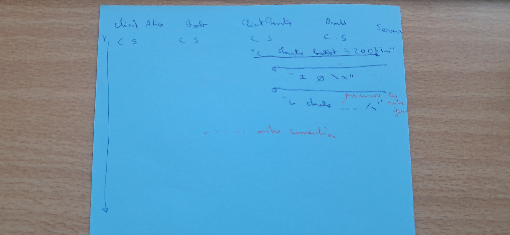

 
 # Modular_Threaded_Event_Coordinator_PECHEUX_S8
 # 📜 Technical Report – Networked Reactive System with FSM Control

## Introduction

This project explores the implementation of a distributed architecture using **low-level system** tools. While based on the game logic of *Sherlock 13*, its primary aim is not to reproduce game mechanics, but to **demonstrate and validate core system-level concepts**. Through the development of a networked server-client structure, we put into practice notions such as **sockets**, **multi-threading**, **mutex synchronization**, and **finite-state machines (FSMs)**.

The game setting serves as a *pedagogical vehicle* : it provides context for structured interactions that trigger transitions, **thread activities**, and message **broadcasts**. The server reacts according to an internal FSM, and the system ensures synchronization through mutex-protected shared resources, enabling us to study concurrency and communication under real-world constraints.

---

## System Architecture Overview

The system is composed of a **central server** and **four clients** connected over TCP. The server maintains a **FSM** that controls its behavior during the connection phase and throughout interaction cycles. Each client communicates with the server via a socket, sending structured messages and receiving game state updates in return.

The server uses multiple **POSIX threads** to handle each client independently, ensuring responsiveness and isolation of blocking I/O operations. A **mutex lock** protects shared resources such as the list of connected clients or the current state of the FSM.

---

## General Communication Architecture

### 
à passer en anglais

This diagram illustrates the core structure of communication between components. At the center is the **main server**, responsible for maintaining the FSM and dispatching state updates. Four clients - Alice, Bob, Charlie, and David - connect to the server. Each client is associated with a **local mini-server**, a passive listener designed to handle incoming messages from the server asynchronously.

The green dotted arrows symbolize **state broadcasts** or multi-client responses triggered by the server after processing a message. Red solid arrows represent **client-initiated actions**, such as connection requests or interaction commands. The "thread" and "cookies" notes refer to the server's multithreading logic and internal session/state management, respectively.

---

## Sequence Diagram: Connection Flow

### 
à complété eventuellement avec les étapes suivantes du process (investigation, tentative, fin de jeu) mais c'est long ... 

This sequence diagram presents a detailed view of the initial connection phase and illustrates how the server responds to each new client. Below is a simplified version of the interaction timeline:

1. **Client Charlie**: `C localhost 32003 Charlie`:
   - Server responds with `0\n`,
   - Sends `L Charlie - - - \n` to Alice.

2. **Client Alice** sends `C localhost 32001 Alice`. The server responds with:
   - `1\n` (client ID),
   - `L Charlie Alice - - \n` to both Charlie and Alice.

3. **Client Bob** connects: `C localhost 32002 Bob`. The server sends:
   - `2\n` to Bob,
   - `L Charlie Alice Bob - \n` to Bob, Alice and Charlie.

4. **Client Donald**: `C localhost 32004 Donald`:
   - Responds with `3\n`,
   - Broadcasts `L Charlie Alice Bob Donald \n`. to all clients.

The key takeaway is how **each new client triggers a full-state update**, sent to **all previously connected clients**, ensuring that every client holds the most recent global state.

This diagram also highlights **threaded event management**: for each connection, the server spawns or delegates to a **thread, locks a mutex** during state modification, and triggers appropriate responses via a shared communication buffer.

---

## Titre 3 if need 
### Figure 3 à voir si inspi
Texte texte loren sum 

---

## Future Applications and Perspectives

Beyond the educational context and game-like framing, this project demonstrates the skeleton of a **real-time, concurrent client-server model**, highly applicable to modern systems. In **IoT infrastructures**, a centralized server coordinating sensor data streams from multiple devices could employ this same model. Clients (sensors) report data, and the server responds or broadcasts state changes across the network - all handled through thread-safe queues, FSMs for state validation, and asynchronous notification mechanisms. With adaptations, this could serve as a **base for smart home systems**, **monitoring platforms**, or **data aggregation pipelines** in distributed control systems.

Another relevant application lies in the realm of **collaborative tools** or **real-time multiplayer engines**, where many clients interact through actions that must be validated, sequenced, and rebroadcast. The FSM structure guarantees deterministic responses, while socket communication ensures scalability. By abstracting away the game-specific protocol and focusing on the architecture, this system becomes a potential **foundation for chat servers**, **interactive learning platforms**, or even **networked industrial control**. Its modularity makes it extendable with authentication, database logging, or persistent sessions using techniques such as forking processes or using named pipes for IPC.

---

## Conclusion
... Revenir ici Come back after last "ici code"